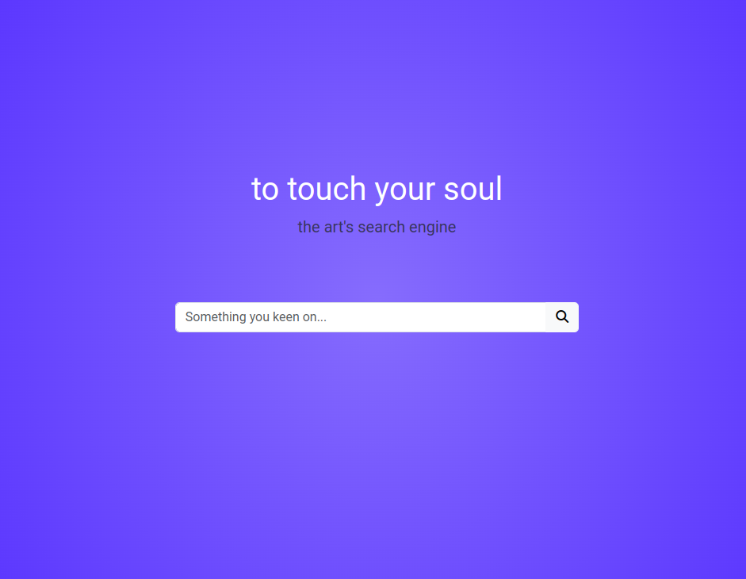
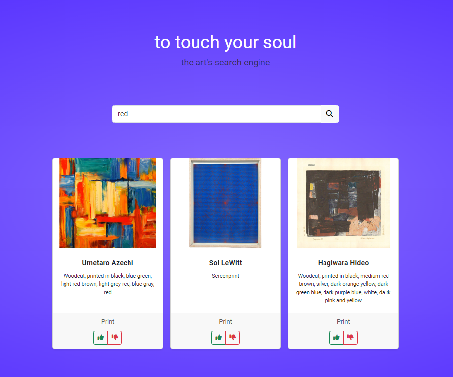

# artworks-app

Система рекомендации объектов исскуства музея [The Museum of Modern Art (NY)](https://www.moma.org) по свободному текстовому вопросу. Работа базируется на использованиии предобученной LLM-модели.
> Проект тестировался с использованием компьютера на os windows и IDE pycharm
## Установка
- Использовать автоматическую установку зависимостей

  `pip install -r req.txt`

- Скачать Noda.js

[ссылка для скачивания](https://nodejs.org/en)

## Альтернативная становка
  
- Сервера для запуска приложения [Fast API](https://fastapi.tiangolo.com/) & Uvicorn server

`pip install fastapi "uvicorn[standart]"`

- Инструменты работы с данными numpy, pandas, gensim

`pip install numpy pandas gensim`

- Другие инструменты для загрузки картинок и файлов

`pip install Pillow gdown imghdr`

И другие зависимости

## Загрузка данных

При первом запуске происходит подгрузка данных с гугл диска.
При повторном приоритет отдается локальному файлу. 

Рекомендуется заранее скачать следующие файлы и сохранить в папку `/data` в корне проекта:
- файл модели https://drive.google.com/uc?id=1TAkVgZNWVLvuEiUsEwn_oSbVLFrRfRVG
- файл с базой объектов https://drive.google.com/uc?id=1cWYd9jYG9nGU0jDJDB3G6X6s-GyB2v_6

## Запуск сервера

Сервер запускается с некоторой задержкой, так как необходимо время для инииализации модели.

`uvicorn main:app --reload`

## Исопльзование

- Введите поисковый запрос после запуска сервера

- В результате вы получите список рекомендаций

- Ниже отражены кнопки оценки качества рекоммендации. Можно дать обратную связь. В дальнейшем это поможет улучшать качество поисковой выдачи.

